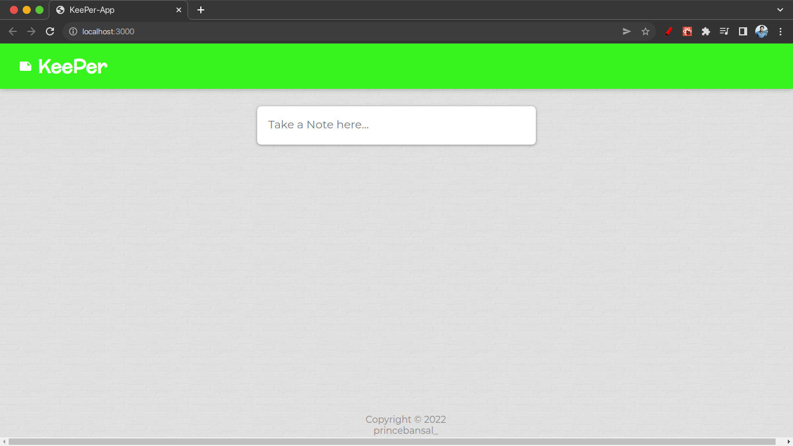
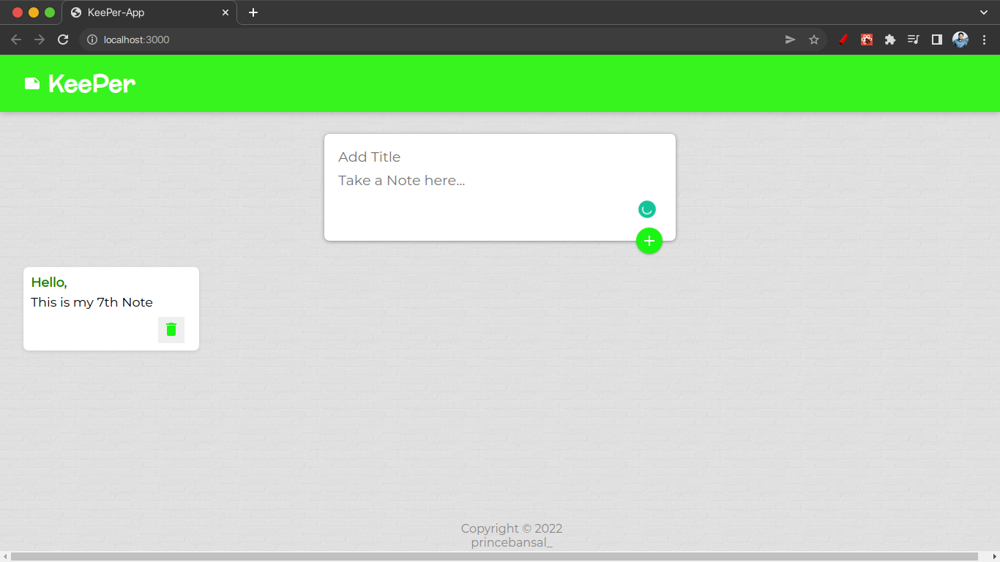
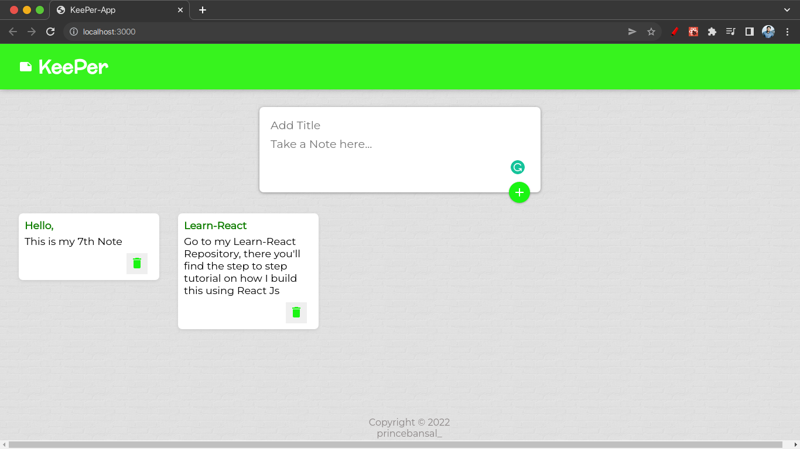
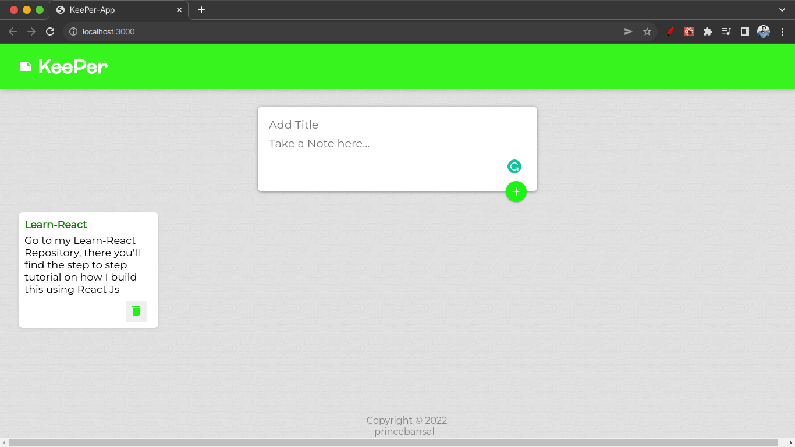

# KeePer-React-App
- This is **Note taking app** (A little like Google Keep) made using React js.
- I haven't added backend yet (to store the Notes functionality.
- I have used Material UI for icons.
- Here are project screenshots:
    
  
  
  
  
  