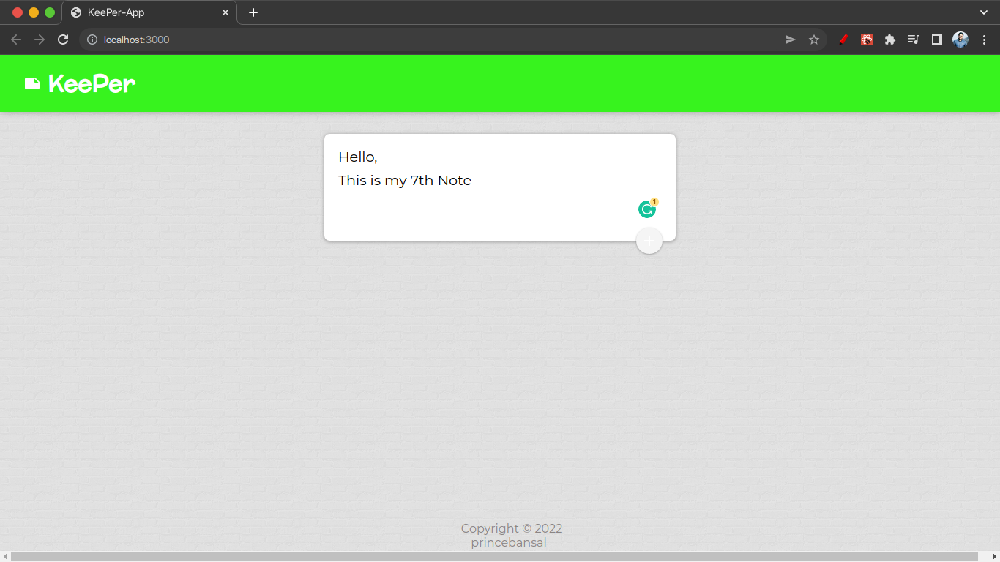

# KeePer-React-App
- This Repo have ToDo app (A little like Google Keep) made using React js.
- I haven't added backend yet to store the Notes functionality, it just have frontend
- I have added some Material UI icons also
- Here are project screenshots:
    
  
  
  
  
  